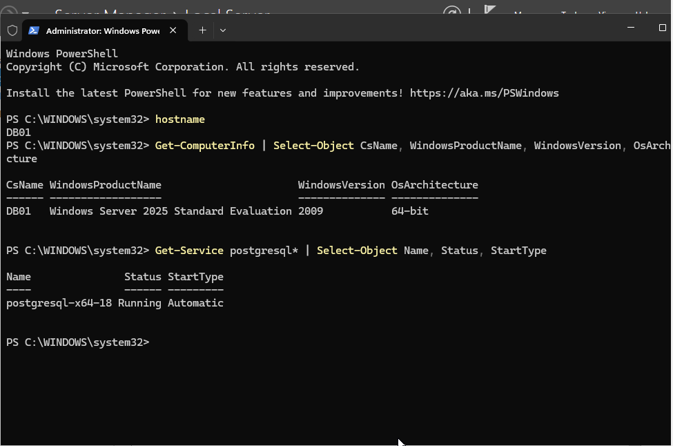
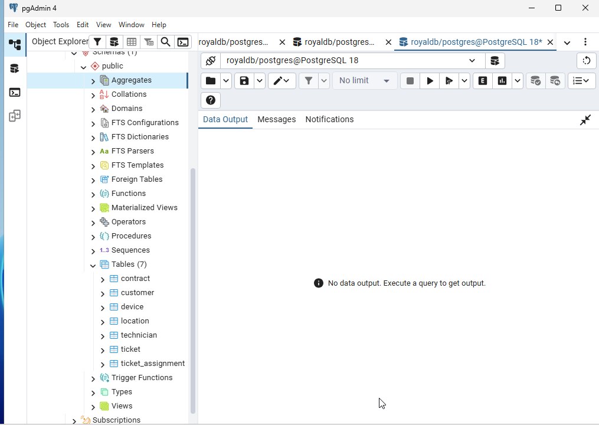
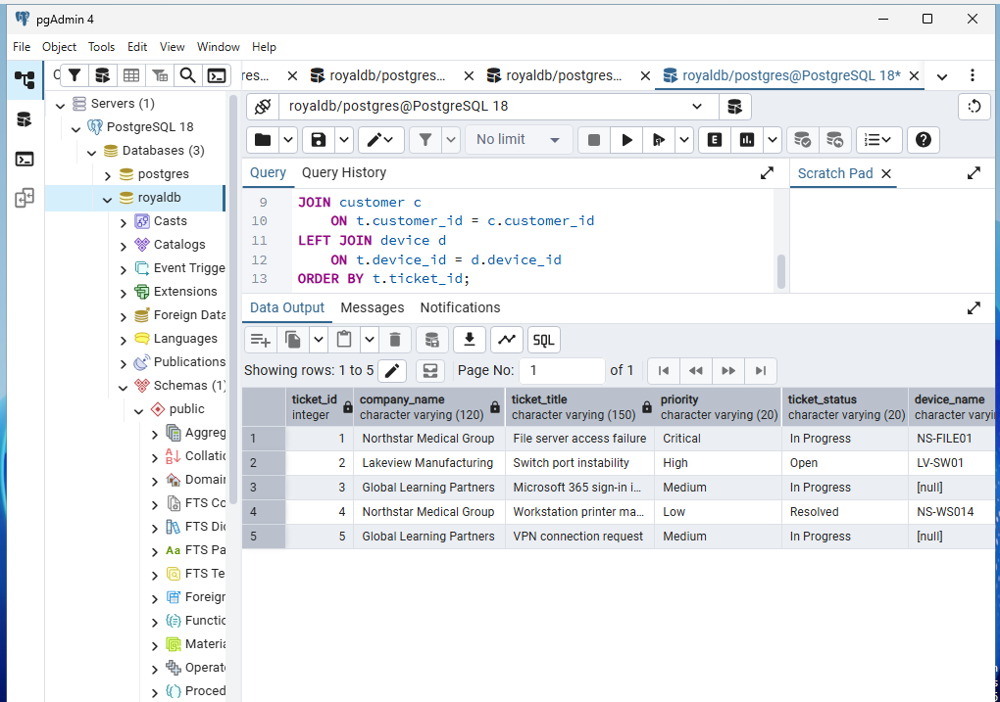
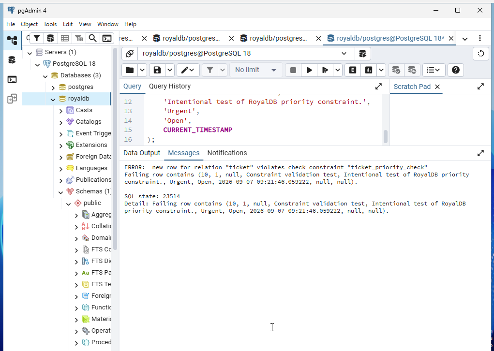
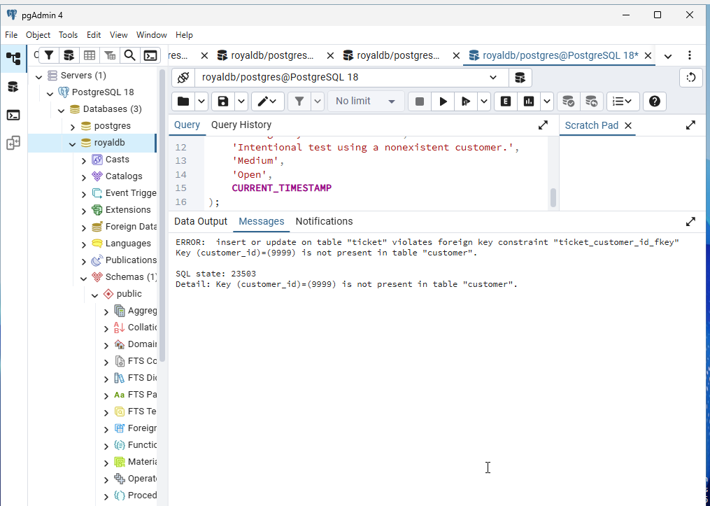
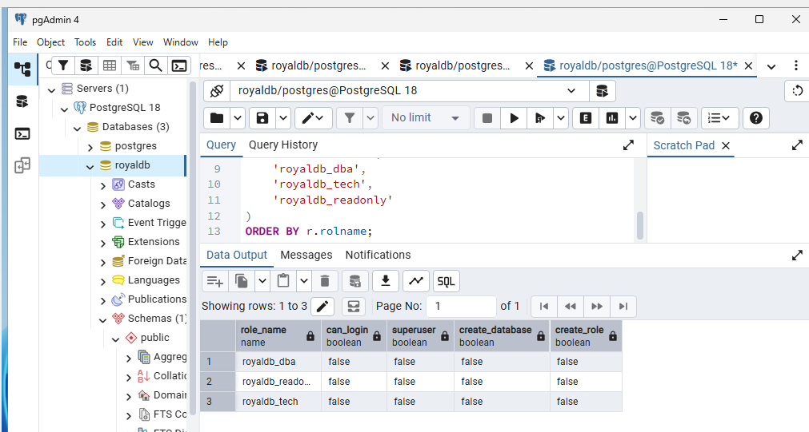
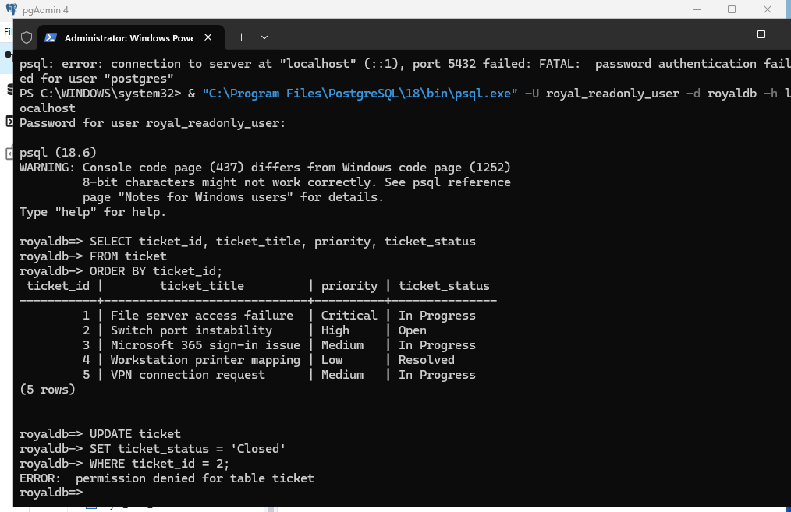
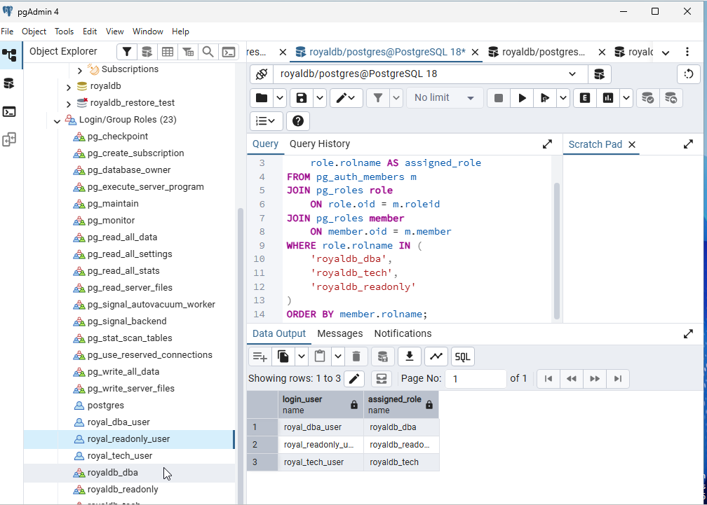
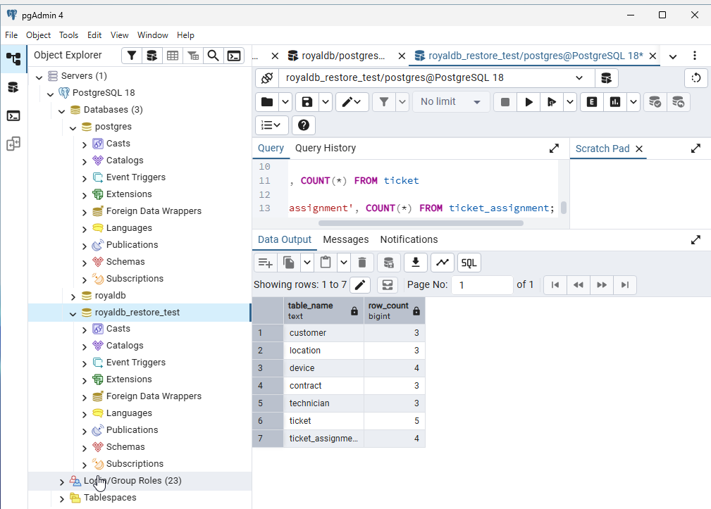
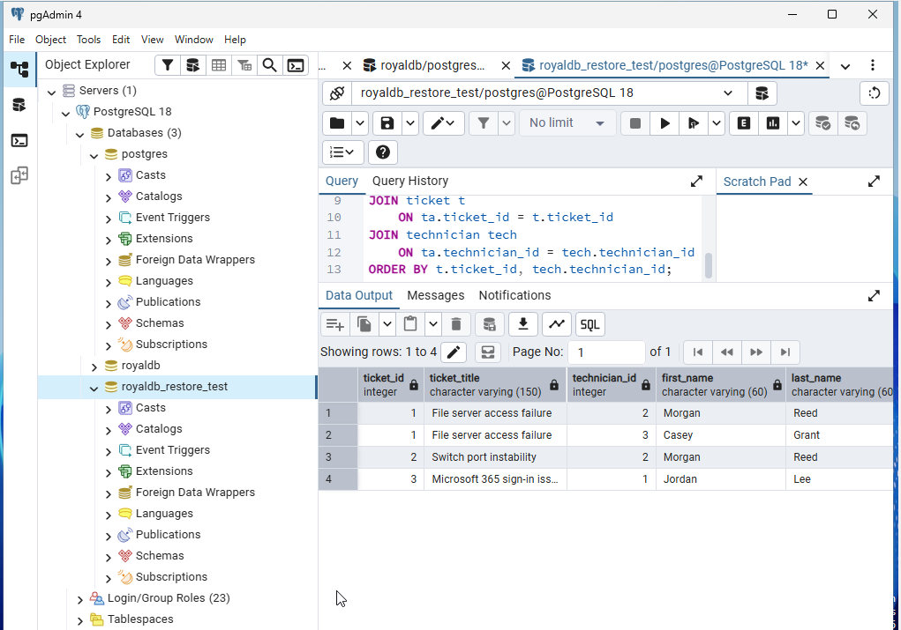

# RoyalDB Implementation Evidence

This directory contains implementation and validation evidence for the RoyalDB PostgreSQL database project. The screenshots demonstrate the database server environment, relational schema, SQL operations, data integrity controls, role-based access control (RBAC), least-privilege enforcement, backup and recovery validation, and relational ticket-assignment functionality.

---

## 1. Database Server Verification

**Evidence:** DB01 is running Windows Server 2025 with the PostgreSQL 18 service configured for automatic startup and actively running.

**Technical Significance:** Demonstrates that RoyalDB is implemented on a dedicated Windows Server environment rather than existing only as a conceptual database design or SQL script.

---

## 2. PostgreSQL Schema and Tables

**Evidence:** The `royaldb` database contains seven relational tables:

- `customer`
- `location`
- `device`
- `contract`
- `technician`
- `ticket`
- `ticket_assignment`

**Technical Significance:** Confirms successful implementation of the RoyalDB relational schema in PostgreSQL 18.

---

## 3. Relational JOIN Verification

**Evidence:** A SQL query joins `ticket`, `customer`, and `device` data to produce operational service-ticket information. A `LEFT JOIN` allows tickets without an associated physical device to remain in the results.

**Technical Significance:** Demonstrates relational querying across multiple tables and supports both device-related and non-device service requests.

---

## 4. CHECK Constraint Enforcement

**Evidence:** An intentional attempt to insert `Urgent` as a ticket priority is rejected by PostgreSQL with SQLSTATE `23514` because the value violates the `ticket_priority_check` constraint.

**Technical Significance:** Demonstrates database-level enforcement of controlled business values and protection against invalid data.

---

## 5. Foreign Key Constraint Enforcement

**Evidence:** An intentional attempt to create a ticket using nonexistent `customer_id 9999` is rejected with SQLSTATE `23503`.

**Technical Significance:** Demonstrates referential integrity by preventing orphaned ticket records from referencing customers that do not exist.

---

## 6. Role-Based Access Control

**Evidence:** RoyalDB includes three non-login group roles:

- `royaldb_dba`
- `royaldb_tech`
- `royaldb_readonly`

The roles do not have unnecessary superuser, database-creation, or role-creation privileges.

**Technical Significance:** Demonstrates role-based access control and separation of database responsibilities.

---

## 7. Least-Privilege Enforcement

**Evidence:** The `royal_readonly_user` successfully executes a `SELECT` query against the ticket table but receives `permission denied for table ticket` when attempting an `UPDATE`.

**Technical Significance:** Demonstrates that least privilege is actively enforced rather than merely documented as a security requirement.

---

## 8. Login User and Role Membership

**Evidence:** PostgreSQL role membership maps dedicated login accounts to their corresponding RoyalDB roles:

- `royal_dba_user` → `royaldb_dba`
- `royal_readonly_user` → `royaldb_readonly`
- `royal_tech_user` → `royaldb_tech`

**Technical Significance:** Demonstrates separation between login identities and reusable permission roles, supporting maintainable RBAC administration.

---

## 9. Database Restore Verification

**Evidence:** The restored `royaldb_restore_test` database contains all seven RoyalDB tables with validated record counts.

**Technical Significance:** Demonstrates that the RoyalDB backup was successfully restored and that recovered relational data was validated after restoration.

---

## 10. Ticket-to-Technician Relationship

**Evidence:** The restored RoyalDB dataset demonstrates ticket-to-technician assignments through the `ticket_assignment` bridge table. Ticket 1 is associated with multiple technicians, confirming the implemented many-to-many relationship.

**Technical Significance:** Demonstrates implementation of a junction/bridge table to resolve the many-to-many relationship between service tickets and technicians.

---

## Skills Demonstrated

This evidence set demonstrates hands-on experience with:

- PostgreSQL 18 administration
- Windows Server 2025
- Relational database implementation
- SQL and multi-table JOIN operations
- Primary and foreign key relationships
- CHECK constraints and data integrity
- Referential integrity
- Role-Based Access Control (RBAC)
- Principle of least privilege
- Database security administration
- Backup and recovery validation
- Many-to-many relational modeling
- Database testing and troubleshooting

---

> **Note:** Constraint violations and permission-denied messages shown in this evidence are intentional validation tests. They demonstrate successful enforcement of database integrity and security controls rather than implementation failures.
